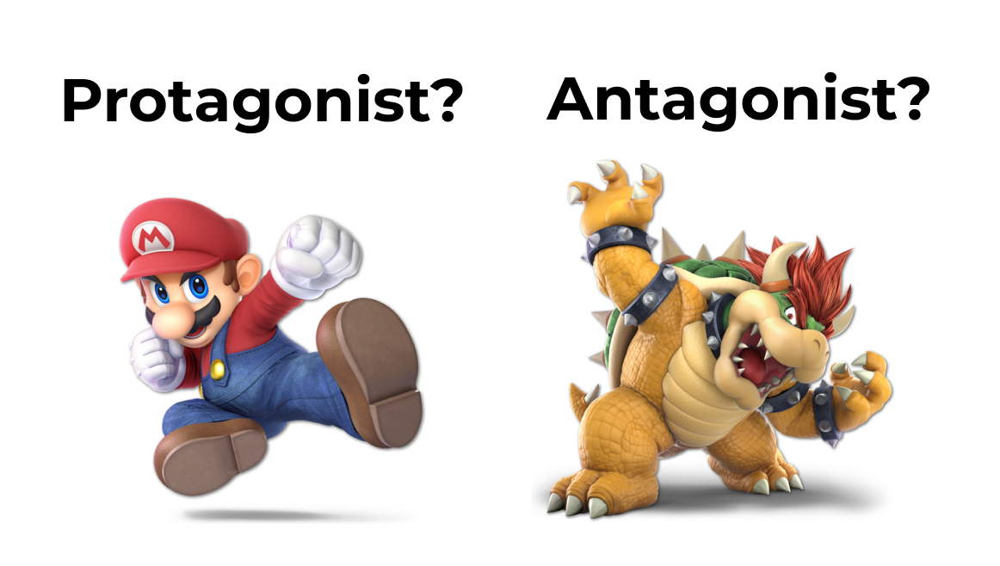
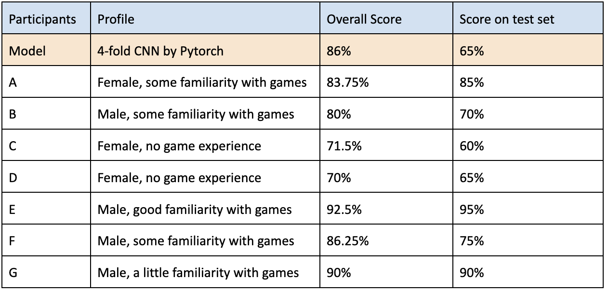
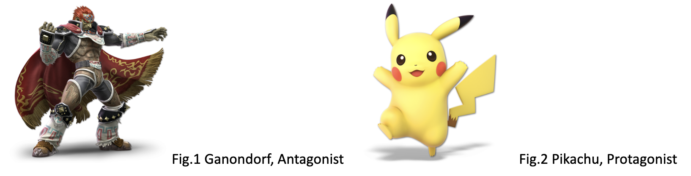
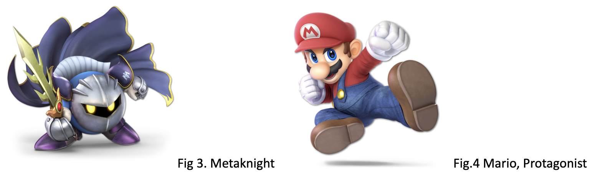
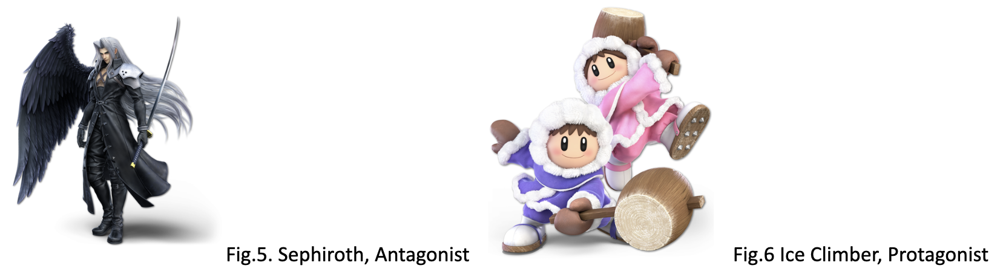
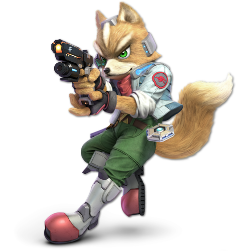
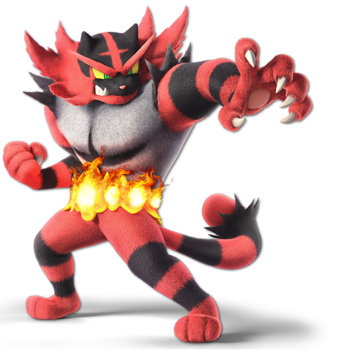

  <h1>Classifying Game Characters Into Protagonists and Antagonists</h1>
  
  <h2><b>Summary</b></h2>
  
From the Bible to TV shows, great stories always consist of protagonists and antagonists to drive the stories exciting and dramatic. 
  Hence, we always try our best to describe their protagonist-ness and antagonist-ness by character design when we visualize them. 
  One of the most obvious examples of this is a classic TV game. 
  In TV games, there are limits to time to explain who’s who and the purpose of the game, so designers need to design the character as everyone immediately recognizes the character’s role.
  This intention crystalizes as design decisions of color, shape, and touches.
  Therefore in this article, I aimed to build CNN (Convolutional Neural Network) to carry out a supervised image classification task to distinguish protagonist-look design and antagonist-look design.
  Next, I compared the classification by CNN with the experiment result of 7 participants on the same task to see the main differences. Finally, I looked over the opportunity space for further studies.

  <h2><b>Objective</b></h2>
  
My interest is (1) to train a deep neural network for image classifiction task, and (2)to compare its tendency with the test results from human participants.

  <h2>Data Source</h2>
  <ul>
    <li><a href = "https://www.smashbros.com/en_US/index.html">Nintendo Super Smash Bros Official Website</a></li>
    
*all data was retreived 2023.12.12

  </ul>

  <h2><b>Approach</b></h2>
  
First, I collected pictures of 80 famous game characters. This time, I chose Super Smash Brothers Ultimate as a main data source.  
  This is mainly because the design quality is guaranteed since the fighters there are from all the legendary games. Secondly, this is also because the quality of pictures and resolution is also normalized well. 
  The fighters of Super Smash Brothers are mostly protagonists but also some antagonists.  
  I added some antagonists collected from other resources to the dataset, and finally made 60 protagonists and 20 antagonists.  
  I also collected the characters’ names and the main game series they starred in too.  
  Next, I labeled the dataset with either of protagonist or antagonist.  
  Considering that there is a lot of evidence and facts available on the internet about the character’s background, I adopted a rule-based classification we learned in class. A set of criteria is as follows. 

  
  <li>If the character played an antagonist at least once in the main game series, they are antagonists.</li>
  <li>If they played an antagonist in the spin-off series (derivative game series), they are antagonists.</li>
  <li>If they played an antagonist in the spin-off movies, novels, or other media mix contents, they are antagonists.</li>
  <li>If none of them are relevant to the character, they are protagonists.</li>

  
For example, Donkey Kong is a protagonist in the game series “Donkey Kong”, but he is originally designed as an antagonist in the “Mario Brothers” series. 
  Therefore I labeled him as an antagonist. Also, Mewtwo is a breedable character in the “Pokemon” series, but he starred in the movie “Mewtwo Strikes Back” (originally in 1998, remade in 2019).  
  As such, Mewtwo is categorized as an antagonist too. 
  The dataset of labeled pictures is stored here in <a href = "https://github.com/BenBooby/ML_showcase/tree/main/Classification/images">Git Hub</a>. I also organized the data in this <a href = "https://docs.google.com/spreadsheets/d/1YKZr8YswlytX1j3Vd6T6eoxwOYb6w_bIlLCaKmFX2f4/edit#gid=1603174924">Google sheet</a> for convenience.

<h2><b>Implementation</b></h2>
  
I implemented this by CNN, which is one of the best solutions for image classification tasks. 
  In this model, I constructed a simple 6-layer CNN which consists of two convolutional, two pooling, and two fully connected layers. 
  I carried out 4-fold cross-validation using the cross entropy loss function. 
  I controlled the number of epochs to 2 x 4 folds to avoid overfitting. 
  For the code itself, please check the ipynb file in Git Hub.  
  Note: the pictures in the dataset were resized into 500 x 500 through the collection process so the code doesn’t include that step.  

<h2><b>Result</b></h2>

  As a result, our trained model predicts the class with around 65% accuracy on the test set. 
  Also, I asked 7 participants to carry out the same task as the experiment. 
  After finishing the task, we dissected the wrong answers they made and discussed how they made those decisions. 
  Moreover, we went through my model’s answers and asked how they felt about it. 
  The participant’s background varies, but they are all graduate students in Berkeley aged 20s. 
  Most of them had little knowledge of the game characters but still recognized famous characters such as Mario and Bowser. 

<h3>Colors</h3>
  
Through the interview, they gave me feedback on their criteria for telling antagonists and protagonists. The popular idea was the color of the character. If the characters are in dark colors such as blue, gray, and black, that implies they are antagonists. For example, Ganondorf’s black outfit in Fig 1 indicates he is the antagonist, while Pikachu is in a bright yellow and looks cute and harmless.

<h3>Weapons</h3>
  
The second popular reason for guessing is the objects the character has. If the character holds weapons like a sword, gun, or hummer, it tends to look like an antagonist. In Fig3., we see Metaknight holding a sword with spikes, which makes us feel uneasy. Mario in Fig4, on the other hand, has no weapon and looks to be a safe person. 

<h3>Facial Expressions</h3>
 
Another popular reason is facial expression. Antagonists tend to look sad, angry, and serious more frequently than protagonists. For example, Sephiroth stands with grief on his face, holding a long sword, in a black lobe in Fig5. This is the most obvious sign of being an antagonist. Ice Climbers in Fig.6 look smiley and happy, which makes us feel like they are protagonists although they hold huge hummers.

Despite all these rational reasonings, it is still not easy to distinguish them because the total impression is a mixture of these and the character designs contain all of those with different spectrums. We have a lot of antagonists with bright colors and happy facial expressions yet huge weapons, and also protagonists in dark color lobes with sad faces. Also recently we have co-called dark heroes such as Batman, cc, xx. They are designed to look like antagonists intentionally. Not only the complexity of the character design but also the social context such as dark heroes make this task more difficult yet interesting.

<h3>Interesting Mistakes of CNN</h3>

Finally, I would like to look over a couple of mistakes my model made in the test set.

  <li>1. Fox (Protagonist in Starfox)</li>

  
Fox is the main character of Starfox. Although he is a protagonist, the model labeled him as an antagonist. 2 out of 7 participants also made the same mistake, and they said his facial expressions and posture of aiming something by a gun made them feel he was an antagonist. This implies that the model might be heavily influenced by his gun, such a small portion of the design, just like humans did.

  <li>2. Incineroar (Protagonist in Pokemon)</li>
  
  
Incineroar is one of the three starting Pokemon you can choose at the beginning of the game. However, his facial features, huge claws, and colors look very furious and dangerous, which caused 5 out of 7 participants to make the same mistake.
Participants shared their feeling that it is 100% a villain-look design, and they can empathize with the model for making this mistake.

<h3>Further Studies</h3>

I implemented the model and explored the difference in its performance between human participants and the model. For further exploration, I would take notes of a couple of points. 
ML model selection: Other than deep learning, I would explore classic machine learning solutions such as Principal Component Analysis and Support Vector Machines and compare the performances of each algorithm. This is because classic techniques are more explainable than DL, which tends to be a black box.
Gen AI: It could be very interesting to generate a new character with protagonistic/antagonistic features by image-generating AIs. 

<h2>Work Cited</h2>
<li>Nintendo, 2018, Super Smash Bros for the Nintendo Switch System, accessed 9 Dec. 2023 <https://www.smashbros.com/en_US/index.html></li>
<li>The Pytorch Foundation, Welcome to Pytorch Tutorials, accessed 9 Dec. 2023, <https://pytorch.org/tutorials/></li>
<li>Pranjail Soni, 2021, CNN Model With PyTorch For Image Classification, accessed 9 Dec. 2023, <https://medium.com/thecyphy/train-cnn-model-with-pytorch-21dafb918f48></li>
<li>Glushko et al., 2016, The Discipline of Organizing, MIT Press, <https://berkeley.pressbooks.pub/tdo4p/front-matter/cover/></li>
<li>Fandom, Fire Emblem Wiki, accessed 10 Dec. 2023, <https://fireemblem.fandom.com/wiki/></li>
<li>Wikipedia, Category: Nintendo Protagonist, accessed 10 Dec. 2023, <https://en.wikipedia.org/wiki/Category:Nintendo_protagonists></li>
<li>Fandom, Persona Wiki, accessed 10 Dec. 2023, <https://megamitensei.fandom.com/wiki/Persona_(Series)></li>
<li>IMDb, Pokemon: The First Movie - Mewtwo Strikes Back(1998) - IMDb, accessed 10 Dec. 2023, <https://www.imdb.com/title/tt0190641/></li>

