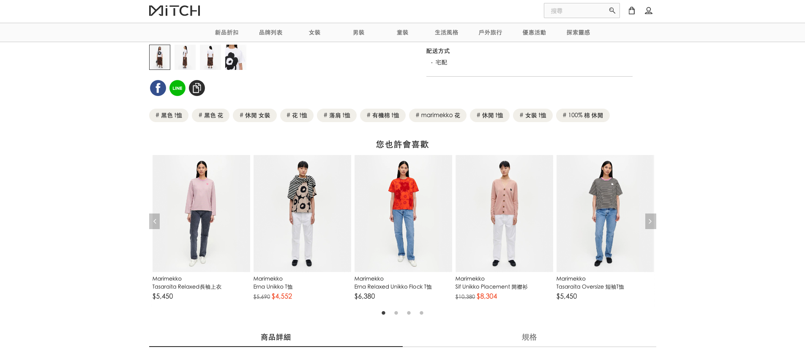
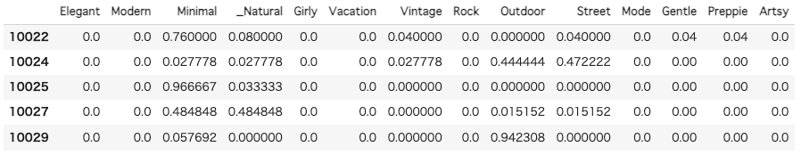
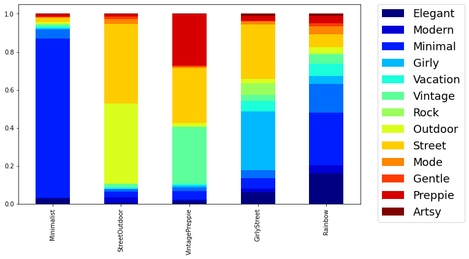
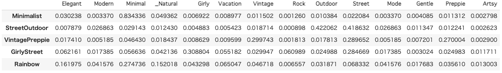
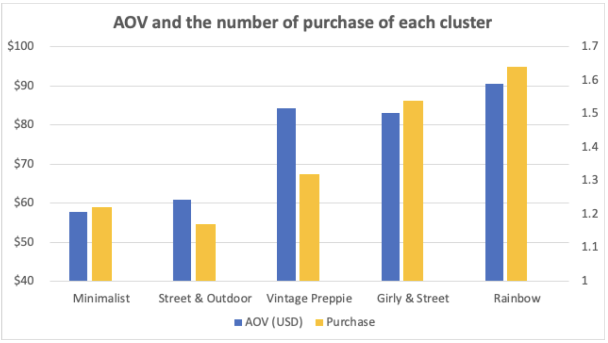

  <h1>User Research on Style preference</h1>
  
  <h2><b>Background</b></h2>
  
This is a user research project in a fashion e-commerce startup at Taiwan in 2021. 
    Back then, our important operational KPI was Average Order Value(AOV). 
    Since the launch of the service, this number had been around 2000 TWD.  
  

  <h2><b>Objective</b></h2>
  
My Mission was to find a product improvement opportunity to enhance this KPI.

  <h2>Data Source</h2>
  <ul>
    <li>Order Data with cusotmer ID (e.g. datetime, product_ID, customer_ID, return_status, etc)</li>
    <li>Product Data(e.g. product_ID, product_name, product_page_url, brand_ID, etc)</li>
    <li>User action data from Google Analytics(e.g. pageview, screen scrool, click etc)</li>
    <li>style-brand mapping data (e.g brand_ID, style_ID, style_name)</li>
    
*all data was from 2020/03~2021/8

  </ul>

  <h2><b>Approach</b></h2>
  
I ran both quantitative and qualitative analysis for this project.

  <h3>1. Qualitative Analysis</h3>

  
In the user interviews with our loyal customers, we realized our recommendation lacked diversity in fashion styles such as sporty, elegant, street and soon. From here, we created hypothesis that recommending more diverse products would contribute user satisfaction.

  <h3>2. Quantitative Analysis (the main point of this notebook!)</h3>
  

  Next, I tried to validate this hypothesis by checking whether the users who interacts with a variety of styles buy more products per order than the users who like a limited number of styles. 
  I labeled all the products with the 13 fashion styles our stylist team defined, and calculated the distribution of style preference from product data, order data, and pageview data, like Sport 50%, Elegant 0%, Natural 30%, Street 20%.  

  
  
  Then I clustered them into 5 groups by the distribution of style preference.

   
    
    

<h2><b>Result</b></h2>

  It turned out the more various styles a user prefers, the more they spend with more frequency.
   <b>The group with the most diverse preference(RAINBOW) spend 56% more than the group with the least diverse preference(MINIMALIST).</b> 
 
      
  
 Thus our hypothesis was validated.  
  After that, we worked on this opportunity and improved our recommendation on another project, it increased the KPI by <b>15%</b>.

